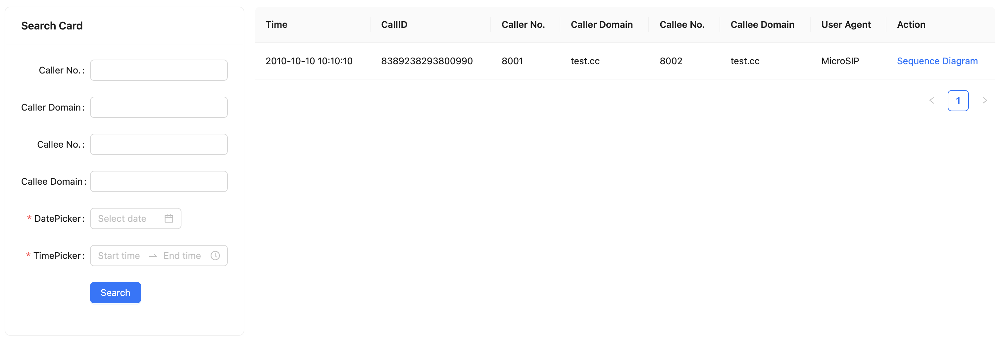

# V23 Roadmap, under developing

- sipgrep-go merge into sipgrep-ui, so there are no sipgrep-ui or sipgrep-go, just one sipgrep.
- using react + ant design as ui frame
- using golang fiber as the web server, no nodejs
- using [SequenceDiagram](https://github.com/davidje13/SequenceDiagram) to draw sip sequence dragram 
- add pagenation
- add login page


this is the first version




For production, Please use [siphub v22](https://github.com/wangduanduan/siphub/tree/master)

# Feature

- [ ] search call
- [ ] show SIP sequence diagram
- [ ] bind A-Leg and B-Leg
- [ ] load balance
- [ ] cluster
- [ ] call statistic

## db

- only support mysql 8
- you need create a db which name sipgrep, the sipgrep will create table auto

# Inter

## OpenSIPS 2X

test witch OpenSIPS 2.4

```bash
# add hep listen
listen=hep_udp:your_ip:9061

loadmodule "proto_hep.so"
# replace SIP_HUB_IP_PORT with sipgrep‘s ip:port
modparam("proto_hep", "hep_id","[hep_dst] SIP_HUB_IP_PORT;transport=udp;version=3") 
loadmodule "siptrace.so"
modparam("siptrace", "trace_id","[tid]uri=hep:hep_dst")

# add ite in request route();
if(!is_method("REGISTER") && !has_totag()){
  sip_trace("tid", "d", "sip");
}
```

## OpenSIPS 3.x 

```
socket=hep_udp:127.0.0.1:9060
loadmodule "proto_hep.so"
modparam("proto_hep", "hep_id","[hid] SIPGREP_IP:SIPGREP_PORT;transport=udp;version=3")
loadmodule "tracer.so"
modparam("tracer", "trace_id","[tid]uri=hep:hid")


route {
    ...
    if (has_totag()) {
        route(r_seq_request);
    } else {
		trace("tid", "d", "sip");
    }
    ...
}
```

## FreeSWITCH

fs version 1.6.8+ 

编辑： sofia.conf.xml

用真实的sipgrep ip:port替换SIPGREP_IP:SIPGREP_PORT

```
<param name="capture-server" value="udp:SIPGREP_IP:SIPGREP_PORT;hep=3;capture_id=100"/>
```

```shell
freeswitch@fsnode04> sofia global capture on
 
+OK Global capture on
freeswitch@fsnode04> sofia global capture off
 
+OK Global capture off
```

然后将下面两个文件的sip-capture设置为yes
- sofia_internal.conf.xml
- sofia_external.conf.xml


```
<param name="sip-capture" value="yes"/>
```

最后，建议重启一下fs.

## heplify集成

参考 https://github.com/sipcapture/heplify

heplify是一个go语言开发的，基于网卡抓包的方式，捕获sip消息的客户端程序，整个程序就是一个二进制文件，可以不依赖其他组件运行。

- -i 指定网卡。需要更具机器真实网卡进行修改
- -m SIP 指定抓SIP消息
- -hs 指定sipgrep-go的地址。需要根据sipgrep-go的真实地址进行修改
- -p 指定生成日志文件的位置
- -dim 排除某些类型的SIP包，例如排除OPTIONS和REGISTER注册的包
- -pr 指定抓包的端口范围。

```
nohup ./heplify -i eno1 \
  -m SIP \
  -hs 192.168.3.3:9060 \
  -p "/var/log/" \
  -dim OPTIONS,REGISTER \
  -pr "5060-5061" &
```